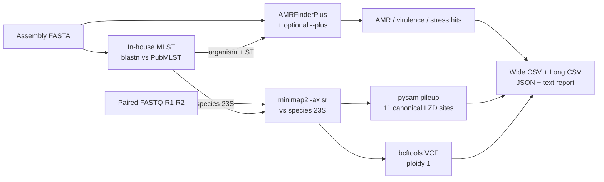

<h1 align="center">linezolid-amr</h1>

<p align="center">
  <strong>End-to-end detection of linezolid heteroresistance and full AMR profiling from short-read bacterial sequencing data.</strong>
</p>

<p align="center">
  <a href="https://github.com/iowa69/linezolid-amr/actions/workflows/ci.yml"></a>
  <a href="https://anaconda.org/bioconda/linezolid-amr"></a>
  <a href="https://anaconda.org/bioconda/linezolid-amr"></a>
  <a href="https://github.com/iowa69/linezolid-amr/blob/master/CITATION.cff"></a>
  <a href="LICENSE"></a>
</p>

<p align="center">
  <a href="#abstract">Abstract</a> ·
  <a href="#workflow">Workflow</a> ·
  <a href="#installation">Installation</a> ·
  <a href="#usage">Usage</a> ·
  <a href="#outputs">Outputs</a> ·
  <a href="#methods">Methods</a> ·
  <a href="#validation">Validation</a> ·
  <a href="#worked-example">Worked example</a> ·
  <a href="#citation">Citation</a>
</p>

---

## Abstract

Linezolid resistance in Gram-positive pathogens is most often **heteroresistant**: the resistance-conferring 23S rRNA mutation (most commonly G2576T) is carried by only a subset of the multiple rRNA operons present in the genome. Because the resistant allele is a minority, the assembly consensus base remains wild type and every assembly-only AMR caller — including state-of-the-art tools — fails to flag the strain. **linezolid-amr** addresses this gap by chaining three analyses driven by a single organism call:

1. **Multi-locus sequence typing (MLST)** — in-house BLAST-based Python implementation backed by bundled PubMLST schemes (Jolley et al., 2018). Cross-validated locus-by-locus on real cohorts.
2. **Acquired AMR / virulence / stress profiling** — NCBI AMRFinderPlus (Feldgarden et al., 2021) with optional `--plus` extension.
3. **23S rRNA heteroresistance detection** — minimap2 short-read alignment to a species-specific 23S reference followed by per-position allele-frequency profiling at the 11 canonical linezolid-resistance positions in *E. coli* K-12 numbering (Kloss et al., 1999; Long & Vester, 2012).

All canonical resistance positions carry verified PubMed citations and the pipeline emits a statistics-friendly sample × gene matrix alongside per-sample machine-readable JSON, BAM, and VCF artefacts. The package ships fully offline (PubMLST schemes and 23S references are bundled in the release tarball) and is distributed via Bioconda.

## Workflow



## Supported organisms

The 23S read-level and MLST steps run for the four species below; AMRFinderPlus still runs on any organism it supports when the user passes `-O / --organism` explicitly.

| Organism | rRNA operons | MLST scheme (PubMLST) | 23S reference accession |
|---|:---:|---|---|
| *Staphylococcus aureus* | 5 | `saureus` — 7 loci | NCTC 8325, NC_007795.1 |
| *Enterococcus faecalis* | 4 | `efaecalis` — 7 loci | V583, NC_004668.1 |
| *Enterococcus faecium* | 6 | `efaecium` — 7 loci | DO, NC_017960.1 |
| *Streptococcus pneumoniae* | 4 | `spneumoniae` — 7 loci | TIGR4, NC_003028.3 |

Linezolid-resistance positions are always reported in *E. coli* K-12 23S numbering — the clinical-literature convention — via a pairwise-alignment-derived species-to-*E. coli* position map computed when references are fetched and shipped inside the package.

## Installation

```bash
conda create -n linezolid-amr -c bioconda -c conda-forge linezolid-amr
conda activate linezolid-amr
amrfinder -u   # one-time AMRFinderPlus database download (~150 MB)
```

23S references and PubMLST schemes are bundled inside the package — nothing else to fetch. The package is fully reproducible offline once `amrfinder -u` has run.

To install from source while developing:

```bash
git clone https://github.com/iowa69/linezolid-amr && cd linezolid-amr
conda create -n linezolid-amr -c bioconda -c conda-forge \
    python=3.11 ncbi-amrfinderplus minimap2 samtools bcftools blast
conda activate linezolid-amr
pip install -e .
```

## Usage

### Single sample

```bash
linezolid-amr run \
  -a sample.fasta \
  -1 sample_R1.fq.gz \
  -2 sample_R2.fq.gz \
  -o results/sample
```

`--organism` is optional — MLST infers it. Pass `-O Enterococcus_faecium` to override (a warning is emitted on mismatch).

### Folder mode

```bash
linezolid-amr folder -i input_dir/ -o results/
```

Auto-pairs `*.fasta / *.fa / *.fas / *.fna` with FASTQ siblings. Recognised read suffixes: `_R1_001` / `_R2_001`, `_R1` / `_R2`, `_1` / `_2`, with `.fastq[.gz]` or `.fq[.gz]` extensions. Files without a paired-read partner are flagged and skipped.

### All command-line options

| Option | Default | Meaning |
|---|---|---|
| `-a, --assembly` | — | Genome assembly FASTA (single-sample mode) |
| `-1, --r1` / `-2, --r2` | — | Paired reads (single-sample mode) |
| `-i, --input` | — | Input directory (folder mode) |
| `-o, --outdir` | — | Output directory (required) |
| `-s, --sample` | assembly stem | Sample name |
| `-O, --organism` | auto via MLST | Override organism call. Accepted values (must match exactly, underscore-separated): `Staphylococcus_aureus`, `Enterococcus_faecalis`, `Enterococcus_faecium`, `Streptococcus_pneumoniae`. Any other AMRFinderPlus organism name (e.g. `Klebsiella_pneumoniae`) is allowed too — the 23S step is skipped in that case. |
| `-t, --threads` | all available CPUs | Parallel threads |
| `--plus` | off | Pass AMRFinderPlus `--plus` (stress / virulence / biocide) |
| `--min-af` | **0.15** | Minimum 23S alt-allele frequency for a positive call |
| `--min-depth` | 20 | Minimum read depth at a 23S position |
| `--skip-amrfinder`, `--skip-rrna23s` | — | Skip either pipeline stage |

## Outputs

```
results/sample/
├── amrfinder/amrfinder.tsv             # all AMR / virulence / stress hits (AMRFinderPlus TSV)
├── rrna23s/
│   ├── sample.23S.bam (+ .bai)         # sorted, indexed short-read alignment
│   ├── sample.23S.vcf.gz (+ .csi)      # bcftools-called variants across 23S
│   └── sample.23S_lzd_pileup.tsv       # per-position allele frequencies at LZD sites
├── sample.linezolid_amr.json           # combined machine-readable report
├── sample.linezolid_amr.txt            # human-readable summary
├── sample.summary_wide.csv             # one row · one column per detected feature
└── sample.summary_long.csv             # one row per gene / mutation
```

Folder mode appends `ALL_samples.summary_wide.csv` and `ALL_samples.summary_long.csv` at the top of `outdir/`, ready to load into pandas / R for cohort-level analysis.

### Wide CSV layout (statistics-ready matrix)

| Column group | Cell value |
|---|---|
| `sample, organism, mlst_scheme, ST, mlst_alleles, linezolid_call, lzd_n_23S_mutations, lzd_max_23S_af` | Identity, MLST, summary statistics |
| `LZD__<gene>` | identity % — any linezolid-relevant AMR hit (`cfr`, `optrA`, `poxtA`, `23S_*`, L3/L4/L22 mutations) |
| `LZD_23S_AF__<mutation>` | allele frequency at a canonical 23S linezolid-resistance position (always populated when an alt is observed, even sub-threshold) |
| `AMR_<class>__<gene>` | identity % — AMR hit grouped by AMRFinderPlus class |
| `VIRULENCE__<gene>` | identity % — virulence factor (only with `--plus`) |
| `STRESS_<class>__<gene>` | identity % — stress / biocide / heat resistance (only with `--plus`) |

A positive linezolid call requires a known resistance allele at AF ≥ `--min-af` (default 0.15, ≈ one full operon copy in the worst-case organism). Sub-threshold AFs remain in the CSV so the reader can judge borderline observations.

## Methods

### MLST

- Schemes for *S. aureus*, *E. faecalis*, *E. faecium* and *S. pneumoniae* are fetched once from the PubMLST REST API (Jolley et al., 2018) and bundled in `linezolid_amr/data/mlst_schemes/<scheme>/` as gzipped allele FASTAs + ST profile tables.
- Allele typing uses `blastn` with options that match `tseemann/mlst` verbatim: `-perc_identity 95 -ungapped -dust no -word_size 32 -evalue 1E-20 -max_target_seqs 100000`, plus `--mincov 50`.
- Per-locus notation (`n` / `~n` / `n?` / `n,m` / `-`) and ST assignment (exact tuple lookup or `-`) reproduce `tseemann/mlst` behaviour exactly.
- `linezolid-amr fetch-mlst-schemes` refreshes the bundled schemes from PubMLST on demand.

### Acquired AMR profiling

- Driven by [NCBI AMRFinderPlus](https://github.com/ncbi/amr) ≥ 4.0 (Feldgarden et al., 2021), launched with the MLST-inferred (or user-supplied) `--organism` and optional `--plus` flag.
- The AMRFinderPlus reference database is auto-downloaded on first run if not present.

### 23S rRNA heteroresistance

- Reads are aligned with `minimap2 -ax sr` (short-read preset) to a single 23S rRNA copy from the species-specific reference; reads from all rRNA operons collapse onto this single locus, giving deep coverage.
- `pysam` performs a base-quality-filtered pileup at the 11 canonical *E. coli*-numbered linezolid-resistance positions; `bcftools` (ploidy 1) calls every variant across the locus.
- Default thresholds for a positive call: AF ≥ 0.15 and depth ≥ 20. Sub-threshold AFs are still emitted in the report (transparency policy).

### Canonical 23S linezolid-resistance positions (E. coli K-12 numbering)

| Position | WT | Resistance | Reference |
|:---:|:---:|:---:|---|
| 2032 | G | A | Kloss et al. 1999 — PMID 10556031 |
| 2447 | G | T / U | Kloss et al. 1999; Long & Vester 2012 |
| 2453 | A | G | Long & Vester 2012 — PMID 22143525 |
| 2500 | T | A | Kloss et al. 1999 |
| 2503 | A | G | Kloss et al. 1999; Long et al. 2006 |
| 2504 | T | A / C | Kloss et al. 1999 |
| 2505 | G | A | Kloss et al. 1999 |
| 2534 | C | T | Long & Vester 2012 |
| 2572 | A | G | Long & Vester 2012 |
| **2576** | **G** | **T / U / A / C** | **Tsiodras et al. 2001 — PMID 11476839 (first clinical case); most prevalent across genera** |
| 2603 | G | T | Long & Vester 2012 |

## Validation

- MLST output was compared against `tseemann/mlst` v2.32 on real-world cohorts; STs and per-locus alleles match 1:1 when both tools see the same PubMLST scheme version.
- The validation script `scripts/validate_mlst_vs_seemann.py` accepts a directory of assemblies, runs both engines, and reports allele-level concordance — useful for ongoing regression testing as schemes evolve.
- Unit tests (`pytest tests/`) verify reference integrity, scheme bundling, MLST allele/ST mapping, summary CSV layout, AMRFinderPlus parsing, and folder-mode discovery.

## Worked example

*Enterococcus faecium* VRE LZD-R clinical isolate, paired Illumina reads + SPAdes assembly:

```text
=== test ===
>> MLST / organism inference...
   organism: Enterococcus_faecium   MLST scheme: efaecium   ST: 80
   alleles: atpA(9)|ddl(1)|gdh(1)|purK(1)|gyd(12)|pstS(1)|adk(1)
>> Running AMRFinderPlus...
   17 hits, 3 linezolid-relevant
>> Running 23S rRNA analysis...
   11 positions; 1 with resistance allele

Linezolid resistance call: POSITIVE
```

```text
ecoli_pos  ref  depth  counts        alt_alleles            is_resistance
2576       G    173    G=58; T=115   T:115:0.6647*          True   ← ~4 of 6 operons mutated
```

## Citation

If you use this software, please cite both the package and the foundational references it relies on. Software citation metadata is in [`CITATION.cff`](CITATION.cff) and is rendered as a GitHub citation card on the repository page.

Key references the pipeline depends on:

- **Kloss et al. 1999** — original mutational mapping of the linezolid binding site. PMID [10556031](https://pubmed.ncbi.nlm.nih.gov/10556031/).
- **Tsiodras et al. 2001** — first clinical G2576T linezolid-resistance description. PMID [11476839](https://pubmed.ncbi.nlm.nih.gov/11476839/).
- **Long & Vester 2012** — comprehensive linezolid resistance review. PMID [22143525](https://pubmed.ncbi.nlm.nih.gov/22143525/).
- **Long et al. 2006** — Cfr 23S methyltransferase mechanism. PMID [16801432](https://pubmed.ncbi.nlm.nih.gov/16801432/).
- **Wang et al. 2015** — discovery of *optrA*. PMID [25977397](https://pubmed.ncbi.nlm.nih.gov/25977397/).
- **Antonelli et al. 2018** — discovery of *poxtA*. PMID [29635422](https://pubmed.ncbi.nlm.nih.gov/29635422/).
- **Jolley et al. 2018** — PubMLST, the source of all MLST schemes used here.
- **Feldgarden et al. 2021** — NCBI AMRFinderPlus, the engine for acquired-AMR profiling.

## Licence

Released under the [MIT licence](LICENSE).
