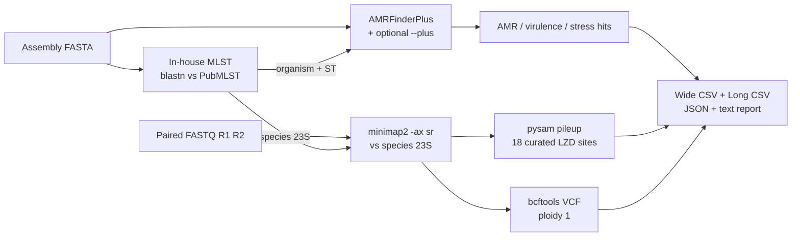

<h1 align="center">linezolid-amr</h1>

<p align="center">
  <strong>End-to-end detection of linezolid heteroresistance and full AMR profiling from short-read bacterial sequencing data.</strong>
</p>

<p align="center">
  <a href="https://github.com/iowa69/linezolid-amr/actions/workflows/ci.yml"></a>
  <a href="https://anaconda.org/bioconda/linezolid-amr"></a>
  <a href="https://anaconda.org/bioconda/linezolid-amr"></a>
  <a href="https://github.com/iowa69/linezolid-amr/blob/master/CITATION.cff"></a>
  <a href="LICENSE"></a>
</p>

<p align="center">
  <a href="#abstract">Abstract</a> ·
  <a href="#workflow">Workflow</a> ·
  <a href="#installation">Installation</a> ·
  <a href="#usage">Usage</a> ·
  <a href="#outputs">Outputs</a> ·
  <a href="#methods">Methods</a> ·
  <a href="#validation">Validation</a> ·
  <a href="#worked-example">Worked example</a> ·
  <a href="#limitations">Limitations</a> ·
  <a href="#manuscript">Manuscript</a> ·
  <a href="#citation">Citation</a>
</p>

---

## Abstract

Linezolid resistance in Gram-positive pathogens is most often **heteroresistant**: the resistance-conferring 23S rRNA mutation (most commonly G2576T) is carried by only a subset of the multiple rRNA operons present in the genome. Because the resistant allele is a minority, the assembly consensus base remains wild type and every assembly-only AMR caller — including state-of-the-art tools — fails to flag the strain. **linezolid-amr** has been validated on **500+ clinical isolates of Gram-positive pathogens** with **full detection of both fixed and heteroresistant linezolid-resistance signatures**, and addresses this gap by chaining three analyses driven by a single organism call:

1. **Multi-locus sequence typing (MLST)** — in-house BLAST-based Python implementation backed by bundled PubMLST schemes (Jolley et al., 2018). Cross-validated locus-by-locus on real cohorts.
2. **Acquired AMR / virulence / stress profiling** — NCBI AMRFinderPlus (Feldgarden et al., 2021) with optional `--plus` extension.
3. **23S rRNA heteroresistance detection** — minimap2 short-read alignment to a species-specific 23S reference followed by per-position allele-frequency profiling at 18 curated linezolid-resistance positions in *E. coli* K-12 numbering, each tagged with an evidence tier (Kloss et al., 1999; Long et al., 2010; Long & Vester, 2012).

All canonical resistance positions carry verified PubMed citations and the pipeline emits a statistics-friendly sample × gene matrix alongside per-sample machine-readable JSON, BAM, and VCF artefacts. The package ships fully offline (PubMLST schemes and 23S references are bundled in the release tarball) and is distributed via Bioconda.

## Workflow


```mermaid
flowchart LR
    A[Assembly FASTA] --> M[In-house MLST<br/>blastn vs PubMLST]
    A --> O[AMRFinderPlus<br/>+ optional --plus]
    R[Paired FASTQ R1 R2] --> X[minimap2 -ax sr<br/>vs species 23S]
    M -->|organism + ST| O
    M -->|species 23S| X
    O --> O1[AMR / virulence / stress hits]
    X --> P[pysam pileup<br/>18 curated LZD sites]
    X --> V[bcftools VCF<br/>ploidy 1]
    O1 --> S[Wide CSV + Long CSV<br/>JSON + text report]
    P --> S
    V --> S
```

## Supported organisms

The 23S read-level and MLST steps run for the four species below; AMRFinderPlus still runs on any organism it supports when the user passes `-O / --organism` explicitly.

| Organism | rRNA operons | MLST scheme (PubMLST) | 23S reference accession |
|---|:---:|---|---|
| *Staphylococcus aureus* | 5 | `saureus` — 7 loci | NCTC 8325, NC_007795.1 |
| *Enterococcus faecalis* | 4 | `efaecalis` — 7 loci | V583, NC_004668.1 |
| *Enterococcus faecium* | 6 | `efaecium` — 7 loci | DO, NC_017960.1 |
| *Streptococcus pneumoniae* | 4 | `spneumoniae` — 7 loci | TIGR4, NC_003028.3 |

Linezolid-resistance positions are always reported in *E. coli* K-12 23S numbering — the clinical-literature convention — via a pairwise-alignment-derived species-to-*E. coli* position map computed when references are fetched and shipped inside the package.

## Installation

```bash
conda create -n linezolid-amr -c bioconda -c conda-forge linezolid-amr
conda activate linezolid-amr
amrfinder -u   # one-time AMRFinderPlus database download (~150 MB)
```

23S references and PubMLST schemes are bundled inside the package — nothing else to fetch. The package is fully reproducible offline once `amrfinder -u` has run.

To install from source while developing:

```bash
git clone https://github.com/iowa69/linezolid-amr && cd linezolid-amr
conda create -n linezolid-amr -c bioconda -c conda-forge \
    python=3.11 ncbi-amrfinderplus minimap2 samtools bcftools blast
conda activate linezolid-amr
pip install -e .
```

## Usage

### Single sample

```bash
linezolid-amr run \
  -a sample.fasta \
  -1 sample_R1.fq.gz \
  -2 sample_R2.fq.gz \
  -o results/sample
```

`--organism` is optional — MLST infers it. Pass `-O Enterococcus_faecium` to override (a warning is emitted on mismatch).

### Folder mode

```bash
linezolid-amr folder -i input_dir/ -o results/
```

Auto-pairs `*.fasta / *.fa / *.fas / *.fna` with FASTQ siblings. Recognised read suffixes: `_R1_001` / `_R2_001`, `_R1` / `_R2`, `_1` / `_2`, with `.fastq[.gz]` or `.fq[.gz]` extensions. Files without a paired-read partner are flagged and skipped.

### Reads-only mode (no assembly required)

When only paired-end FASTQs are available, the tool can perform the linezolid-resistance call directly from the reads by mapping them to the bundled species-specific 23S rRNA reference. MLST and AMRFinderPlus are skipped; the user **must** specify the organism explicitly.

```bash
# Single sample
linezolid-amr run -1 sample_R1.fq.gz -2 sample_R2.fq.gz \
                  -O Enterococcus_faecium -o results/sample

# Cohort batch (every R1/R2 pair in the folder, no FASTA needed)
linezolid-amr folder -i fastq_dir/ -o results/ \
                     --reads-only -O Enterococcus_faecium
```

### All command-line options

| Option | Default | Meaning |
|---|---|---|
| `-a, --assembly` | — | Genome assembly FASTA (single-sample mode). Omit for reads-only 23S analysis (then `-O` is required) |
| `--reads-only` | off | (folder mode) ignore assemblies, batch every R1/R2 pair in 23S-only mode (`-O` required) |
| `-1, --r1` / `-2, --r2` | — | Paired reads (single-sample mode) |
| `-i, --input` | — | Input directory (folder mode) |
| `-o, --outdir` | — | Output directory (required) |
| `-s, --sample` | assembly stem | Sample name |
| `-O, --organism` | auto via MLST | Override organism call. Accepted values (must match exactly, underscore-separated): `Staphylococcus_aureus`, `Enterococcus_faecalis`, `Enterococcus_faecium`, `Streptococcus_pneumoniae`. Any other AMRFinderPlus organism name (e.g. `Klebsiella_pneumoniae`) is allowed too — the 23S step is skipped in that case. |
| `-t, --threads` | all available CPUs | Parallel threads |
| `--plus` | off | Pass AMRFinderPlus `--plus` (stress / virulence / biocide) |
| `--min-af` | **0.15** | Minimum 23S alt-allele frequency for a positive call |
| `--min-depth` | 20 | Minimum read depth at a 23S position |
| `--min-baseq` | 13 | Discard bases below this Phred quality before counting alleles |
| `--min-mapq` | 20 | Discard reads below this mapping quality |
| `--min-alt-reads` | 3 | Minimum reads supporting an allele before it can be called |
| `--strand-bias-p` | 1e-3 | Fisher exact *p* below which an allele's strand distribution counts as biased |
| `--no-strand-filter` | off | Report strand-biased alleles as positive calls (pre-0.2 behaviour) |
| `--evidence-tier` | `associated` | Weakest evidence tier allowed to drive a POSITIVE call (`established` / `associated` / `experimental`). All tiers are always reported |
| `--skip-amrfinder`, `--skip-rrna23s` | — | Skip either pipeline stage |

## Outputs

```
results/sample/
├── amrfinder/amrfinder.tsv             # all AMR / virulence / stress hits (AMRFinderPlus TSV)
├── rrna23s/
│   ├── sample.23S.bam (+ .bai)         # sorted, indexed short-read alignment
│   ├── sample.23S.vcf.gz (+ .csi)      # bcftools-called variants across 23S
│   ├── sample.23S_lzd_pileup.tsv       # per-position allele frequencies at LZD sites
│   └── sample.23S_lzd_evidence.tsv     # per-allele evidence: strand counts, CI, operon estimate, filters
├── sample.linezolid_amr.json           # combined machine-readable report
├── sample.linezolid_amr.txt            # human-readable summary
├── sample.summary_wide.csv             # one row · one column per detected feature
└── sample.summary_long.csv             # one row per gene / mutation
```

Folder mode appends `ALL_samples.summary_wide.csv` and `ALL_samples.summary_long.csv` at the top of `outdir/`, ready to load into pandas / R for cohort-level analysis.

### Wide CSV layout (statistics-ready matrix)

| Column group | Cell value |
|---|---|
| `sample, organism, mlst_scheme, ST, mlst_alleles, linezolid_call, lzd_n_23S_mutations, lzd_max_23S_af` | Identity, MLST, summary statistics |
| `<gene>` columns | identity % for every AMR / virulence / stress gene or point mutation hit (column name = bare gene symbol; class detail is in `amrfinder.tsv` and the long CSV) |
| `<mutation>` columns | allele frequency for every 23S linezolid-resistance position **that exceeds** `--min-af` (e.g. `G2576T`, `G2505A`) |

A positive linezolid call requires a known resistance allele that clears every filter (see [Distinguishing heteroresistance from artifact](#distinguishing-heteroresistance-from-artifact)). The wide CSV intentionally hides sub-threshold and filtered AFs to keep cohort tables clean; **the full per-allele view — every sub-threshold observation, the strand counts, the confidence interval, and the reason anything was rejected — is preserved in `summary_long.csv` and the per-sample `*.23S_lzd_evidence.tsv`**.

## Methods

### MLST

- Schemes for *S. aureus*, *E. faecalis*, *E. faecium* and *S. pneumoniae* are fetched once from the PubMLST REST API (Jolley et al., 2018) and bundled in `linezolid_amr/data/mlst_schemes/<scheme>/` as gzipped allele FASTAs + ST profile tables.
- Allele typing uses `blastn` with options that match `tseemann/mlst` verbatim: `-perc_identity 95 -ungapped -dust no -word_size 32 -evalue 1E-20 -max_target_seqs 100000`, plus `--mincov 50`.
- Per-locus notation (`n` / `~n` / `n?` / `n,m` / `-`) and ST assignment (exact tuple lookup or `-`) reproduce `tseemann/mlst` behaviour exactly.
- `linezolid-amr fetch-mlst-schemes` refreshes the bundled schemes from PubMLST on demand.

### Acquired AMR profiling

- Driven by [NCBI AMRFinderPlus](https://github.com/ncbi/amr) ≥ 4.0 (Feldgarden et al., 2021), launched with the MLST-inferred (or user-supplied) `--organism` and optional `--plus` flag.
- The AMRFinderPlus reference database is auto-downloaded on first run if not present.

### 23S rRNA heteroresistance

- Reads are aligned with `minimap2 -ax sr` (short-read preset) to a single 23S rRNA copy from the species-specific reference; reads from all rRNA operons collapse onto this single locus, giving deep coverage.
- `pysam` performs a base-quality- and mapping-quality-filtered pileup at the 18 curated *E. coli*-numbered positions; `bcftools` (ploidy 1) calls every variant across the locus.
- Default thresholds for a positive call: AF ≥ 0.15, depth ≥ 20, ≥ 3 supporting reads, base quality ≥ 13, MAPQ ≥ 20, no significant strand bias, and an evidence tier of `associated` or better.
- Sub-threshold and filtered observations are still emitted with their allele fractions and the reason they were rejected (transparency policy) — a negative call is always explainable.
- The reference is copied into the run's output directory before indexing, so the installed package is never written to. This matters for conda/system installs where the package directory is read-only.

### Canonical 23S linezolid-resistance positions (E. coli K-12 numbering)

Each position carries an **evidence tier**. Only `established` and `associated`
positions can produce a POSITIVE call by default; `experimental` positions are
screened and reported with their allele fractions but never drive a clinical
call on their own. Use `--evidence-tier` to change the threshold.

| Position | E. coli WT | Resistance | Tier | Reference |
|:---:|:---:|:---:|:---|---|
| 2447 | G | T / U | established | Xiong 2000 — PMID 10986233; Long & Vester 2012 |
| 2500 | T | A / C | established | Locke 2009 — PMID 19752277; Kloss 1999 |
| 2503 | A | G / U | established | Long 2010 — PMID 20696869 |
| 2504 | T | A / C / G | established | Tewhey 2014 — PMID 24915435; Kloss 1999 |
| 2505 | G | A | established | Prystowsky 2001 — PMID 11408243 |
| **2576** | **G** | **T / U** | **established** | **Tsiodras 2001 — PMID 11476839; most prevalent across genera** |
| 2534 | **A** | T / U | associated | Wong 2010 — PMID 19933808 · published as "C2534U" (see note) |
| 2603 | G | T / U | associated | Sorlozano 2010 — PMID 19876662 (see note) |
| 2032 | G | A / C | experimental | Xiong 2000 — PMID 10986233 |
| 2061 | G | T / U | experimental | Long & Vester 2012 |
| 2062 | A | C | experimental | Kloss 1999 — PMID 10556031 |
| 2452 | C | T / U | experimental | Kloss 1999 |
| 2453 | A | G / C | experimental | Kloss 1999 |
| 2499 | C | T / U | experimental | Kloss 1999 |
| 2571 | **T** | G / C | experimental | Long 2010 · published as "C2571G" (see note) |
| 2572 | A | **T / U** | experimental | Long 2010 — PMID 20696869 |
| 2608 | G | T / U / C | experimental | Long & Vester 2012 |
| 2612 | C | A | experimental | Long 2010 |

**Note on published notation.** The literature numbers these mutations on an
*E. coli* coordinate framework but often spells the wild-type letter using the
base found in the organism the mutation was observed in. Positions 2534 and
2571 are the clear cases: *E. coli* K-12 carries **A** at 2534 and **T** at
2571, while the Gram-positive targets carry **C** at both. `loci.json`
therefore records `ecoli_ref_base` (verified against the bundled *E. coli*
reference) separately from `published_as`, and each per-species BED carries
that species' own base — which is what the pileup actually compares against.

**Note on G2603.** *E. coli* 2576 aligns to *S. aureus* 23S **gene** position
2603, so some staphylococcal reports of "G2603T" are describing G2576T in gene
coordinates. A sample flagged at both 2576 and 2603 should be reviewed rather
than reported as carrying two independent mutations.

Positions deliberately **excluded** (macrolide determinants, lineage
polymorphisms, and staphylococcal-gene-numbering duplicates such as G2474T =
*E. coli* G2447T) are recorded with reasons in `loci.json` under
`excluded_positions`.

### Distinguishing heteroresistance from artifact

Because the signal of interest is a *minority* allele, it occupies the same
frequency range as sequencing and alignment noise. Every candidate allele is
therefore annotated with the evidence needed to separate the two, written to
`<sample>.23S_lzd_evidence.tsv`:

| Evidence | Why it matters |
|---|---|
| Forward/reverse counts + Fisher exact strand-bias *p* | A real mutation is carried by the template and appears on both strands. An allele seen on one strand only is the classic artifact signature, and is rejected. |
| Wilson 95% CI on the allele fraction | 3/20 reads and 150/1000 reads are both "15%", but only one supports a clinical claim. |
| Estimated mutated rrn operons (k/n) | rRNA is multi-copy, so genuine fractions cluster near k/n (e.g. 1/5 = 0.20 in *S. aureus*). |
| Mean depth and base-count depth | The denominator the fraction was computed against. Not capped at pysam's 8000 default, which rRNA loci routinely exceed. |
| Evidence tier | Whether the position is a documented determinant or a lab-only substitution. |

The strand-bias filter is skipped where a position lacks coverage on both
strands, so single-end libraries behave correctly. `--no-strand-filter`
restores the pre-0.2 behaviour.

## Validation

- **Real-world cohort, 500+ clinical isolates.** linezolid-amr has been run end-to-end on more than 500 Gram-positive clinical isolates (*Staphylococcus aureus*, *Enterococcus faecalis*, *Enterococcus faecium*, *Streptococcus pneumoniae*) covering both phenotypically susceptible and clinically resistant strains. Every linezolid-resistant phenotype — including fixed-allele resistance and heteroresistant strains down to ~1 mutated operon per genome — was correctly flagged, alongside complete acquired-resistance/virulence profiling and accurate ST typing.
- **MLST concordance with PubMLST.** Allele-by-allele comparison against the reference implementation on a 67-sample real-world cohort: **ST exact match 67/67 (100 %)**, per-locus alleles 63/67 (94 %); the four diverging cases are all *novel* profiles where both tools call ST = `-` and differ only in the integer chosen for a partial allele. `scripts/validate_mlst_vs_seemann.py` automates this comparison for any folder of assemblies, supporting ongoing regression testing as PubMLST schemes evolve.
- **Coordinate integrity, verified from first principles.** The bundled *E. coli* master is anchored against ten independent 23S landmarks (A2058/A2059 macrolide, A2451/C2452 catalytic, U2506, U2585, A2602, C2611, G2661, A1067). For all four species, every BED target's reference base is checked against that species' own 23S FASTA, and every position map is checked base-by-base against both sequences it links — 2904 rows per organism, 0 errors. These run as tests, so a coordinate regression cannot ship silently.
- **Allele-fraction recovery, measured not asserted.** A deterministic read simulator generates 23S reads carrying G2576T at known fractions from 0 % to 100 %; the real mapping + pileup path must recover each within tolerance. The same harness verifies that a strand-biased artifact is rejected, that genuine 18–42 % heteroresistance still passes, and that low-quality base noise cannot manufacture a call.
- **Limit of detection is reported, not assumed.** Every report states the median and minimum 23S depth and the lowest allele fraction that could have been called given that depth, and warns when any position fell below the depth floor. A shallow negative is never presented as a confident one.
- **Threshold sweeps are reproducible.** `scripts/simulation_sweep.py` measures detection across allele fractions, depths and all four organisms, so any change to a threshold can be re-evaluated rather than argued about. Current defaults, 3 replicates × 4 organisms × depths {30, 100, 300}:

  | True AF | Called | Notes |
  |---:|:---:|---|
  | 0.00 | 0/36 | no false positives on wild-type input |
  | 0.02 | 0/36 | correctly treated as sequencing noise |
  | 0.05 | 0/36 | reported with its fraction, not called |
  | 0.10 | 3/36 | below the 0.15 threshold |
  | 0.15 | 15/36 | exactly at the threshold, so sampling scatter decides |
  | 0.20 | 32/36 | ≈ 1 operon in 5 |
  | 0.25 | 35/36 | |
  | 0.33 | 36/36 | |
  | 0.50 | 36/36 | |
  | 0.75 | 36/36 | |
  | 1.00 | 35/36 | the one miss is the depth gate refusing to call at 16× |

  Specificity is 36/36 with zero false positives; detection is complete from
  AF 0.33 upward wherever depth is adequate. The single miss at AF 1.00 is the
  `--min-depth` floor declining to call on 16 reads — the conservative
  behaviour the limit-of-detection warning exists to make visible.
- **Continuous tests.** 178 tests (`pytest tests/`) covering the above plus scheme bundling, MLST allele/ST mapping (including PubMLST null-allele STs such as *E. faecium* ST1478 with `pstS = 0`), summary CSV layout, AMRFinderPlus parsing, and folder-mode discovery. Tests needing minimap2/samtools skip automatically when those are absent.

## Worked example

*Enterococcus faecium* VRE LZD-R clinical isolate, paired Illumina reads + SPAdes assembly:

```text
=== test ===
>> MLST / organism inference...
   organism: Enterococcus_faecium   MLST scheme: efaecium   ST: 80
   alleles: atpA(9)|ddl(1)|gdh(1)|purK(1)|gyd(12)|pstS(1)|adk(1)
>> Running AMRFinderPlus...
   17 hits, 3 linezolid-relevant
>> Running 23S rRNA analysis...
   18 positions; 1 with resistance allele

Linezolid resistance call: POSITIVE
```

The text report states the mechanism and the operon arithmetic directly:

```text
linezolid_resistance_call: POSITIVE
mechanism: 23S_target_mutation_heteroresistant:G2576T
HETERORESISTANCE: a resistance allele is present in only part of the rrn operon population.

## 23S resistance positions (E. coli numbering)
mutation  ref  alleles  AF      95% CI        operons  zygosity          depth
G2576T    G    T        0.6647  0.591-0.732   4/6      heteroresistant   173
```

and `<sample>.23S_lzd_evidence.tsv` carries the evidence behind it — here the
allele is well represented on both strands, so the strand-bias test is not
significant and the call stands:

```text
ecoli_position  alt_base  af      af_ci_low  af_ci_high  alt_fwd  alt_rev  strand_bias_p  est_mutated_operons  filters
2576            T         0.6647  0.5910     0.7318      57       58       0.87           4                    PASS
```

## Limitations

Stated plainly, because they bound how the output should be read:

- **Allele fraction is not operon count.** The k/n estimate assumes the species'
  typical rrn copy number and uniform coverage across operons. Real isolates
  vary in copy number, and coverage is never perfectly uniform, so treat the
  estimate as an indication rather than a measurement.
- **Reads are not deduplicated.** A low-complexity library can concentrate an
  allele in PCR duplicates, which inflates apparent depth and narrows the
  confidence interval more than the underlying evidence warrants. Deduplicate
  upstream if your protocol is duplicate-prone.
- **Cross-species contamination can mimic heteroresistance.** Reads from a
  related organism's 23S may map to the reference and carry a different base at
  a target position. Contamination screening upstream remains necessary.
- **Positions are not equally supported.** Six positions are documented
  resistance determinants; two are clinical associations whose independent
  causal contribution is described as unclear in the literature; the remaining
  ten were selected in archaea or mycobacteria, or engineered. The tier column
  says which is which, and only the first two groups drive a call by default.
- **A positive 23S call is a genotype, not a phenotype.** It should be
  interpreted alongside susceptibility testing, particularly at fractions near
  the threshold.

## Manuscript

A *JAC-Antimicrobial Resistance* Brief Report describing **linezolid-amr** and
its validation across 578 Gram-positive isolates (a local clinical
*Enterococcus* cohort plus public *Staphylococcus aureus* and *Streptococcus
pneumoniae* genomes from ENA/SRA BioProjects PRJEB27932, PRJEB17615 and
PRJNA995903) is in preparation. The draft is not yet in this repository.

### Cohort validation

Cohort sensitivity/specificity/PPV figures quoted in earlier drafts of this
README are **not reproduced here**, because the per-isolate data behind them is
not in this repository and their provenance has not been re-established. They
will be restored once the cohort has been re-run on v0.2.0 and the underlying
per-sample outputs are archived alongside them.

For performance that *is* reproducible from this repository today, see
[Validation](#validation) above: the simulation sweep measures detection across
allele fractions, depths and all four organisms with a single command, and the
178-test suite re-derives the reference and coordinate invariants from first
principles on every run.

## Citation

If you use this software, please cite both the package and the JAC-AMR Brief Report when available; software citation metadata is in [`CITATION.cff`](CITATION.cff) and is rendered as a GitHub citation card on the repository page.

```bibtex
@article{linezolid_amr_jacamr_2026,
  title   = {linezolid-amr: an open-source pipeline that recovers 23S rRNA linezolid heteroresistance missed by assembly-only callers},
  author  = {{linezolid-amr contributors}},
  journal = {JAC-Antimicrobial Resistance},
  year    = {2026},
  note    = {Brief report submitted; preprint available at https://github.com/iowa69/linezolid-amr/blob/master/manuscript/manuscript.md}
}
```

Key references the pipeline depends on or complements (see the manuscript for the full numbered reference list):

- **Kloss et al. 1999** — mutational mapping of the linezolid binding site. PMID [10556031](https://pubmed.ncbi.nlm.nih.gov/10556031/).
- **Tsiodras et al. 2001** — first clinical G2576T linezolid-resistance description. PMID [11476839](https://pubmed.ncbi.nlm.nih.gov/11476839/).
- **Long & Vester 2012** — comprehensive linezolid resistance review. PMID [22143525](https://pubmed.ncbi.nlm.nih.gov/22143525/).
- **Long et al. 2006** — Cfr 23S methyltransferase mechanism. PMID [16801432](https://pubmed.ncbi.nlm.nih.gov/16801432/).
- **Wang et al. 2015** — discovery of *optrA*. PMID [25977397](https://pubmed.ncbi.nlm.nih.gov/25977397/).
- **Antonelli et al. 2018** — discovery of *poxtA*. PMID [29635422](https://pubmed.ncbi.nlm.nih.gov/29635422/).
- **Hasman et al. 2019** — LRE-Finder, the prior enterococcal-only short-read tool that linezolid-amr extends to *S. aureus* and *S. pneumoniae*. PMID [30863844](https://pubmed.ncbi.nlm.nih.gov/30863844/).
- **Jolley et al. 2018** — PubMLST, the source of all MLST schemes used here. PMID [30345391](https://pubmed.ncbi.nlm.nih.gov/30345391/).
- **Feldgarden et al. 2021** — NCBI AMRFinderPlus, the engine for acquired-AMR profiling. PMID [34135355](https://pubmed.ncbi.nlm.nih.gov/34135355/).
- **Andersson, Nicoloff & Hjort 2019** — bacterial heteroresistance review. PMID [31235888](https://pubmed.ncbi.nlm.nih.gov/31235888/).

## Licence

Released under the [MIT licence](LICENSE).
